# Assignment 1 - ReactJS app.

Name: Donal Wall

## Overview.

This a React App that uses TMDB(The Movie Database) API Key to call over information from this website, and display it in my react app that I created

### Features.

+ New Trending Movies Page
+ New Top Rated Movies page
+ Updated Homepage(With Pagination and New Filtering Options)
+ New Similar Movies Page
+ Movie Actors Page and Move Actors Details Page
+ Movies are linked to specific actors(On Actor Details page)
+ New Movie Actors Filter
+ Login and SignUp Page Added(Authenication Using Firebase was attempted)
+ An attempt Private Routes added to Movies favorites page

## Setup requirements.

No non-standerd setup options

## API endpoints.

+ movies/trending -  A list of trending movies
+ movies/:id/similar - A list of similar movies based on a specifc movie
+ movies/toprated -  A list of the top rated movies of all time
+ movies/now-playing - A list of movies that are now playing in cinemas
+ actors/ - A list of movie actors
+ actors/:id - A Actor details page, including their specific filmogrophy
+ page=:pageNumber - Used for pagination on the Discover Movies page
+ users/signup - A sign up form
+ users/login - A login Form(Attempted Using Authenication from Firebase)

## Routing.

+ movies/trending - Displays a movies page with trending movies
+ movies/:id/similar - Displays a page of similar movies to a certain movie
+ movies/toprated - Displays a list of top rated movies of all time
+ movies/now-playing - Displays a list of movies playing now in cinemas
+ actors/ - Displays a list of popular movie actors
+ actors/:id - Displays a page with actor details and the movies they are in (filmogrophy)
+ users/signup - Displays a Signup page
+ users/login - Displays a Login Page

## Images of my pages
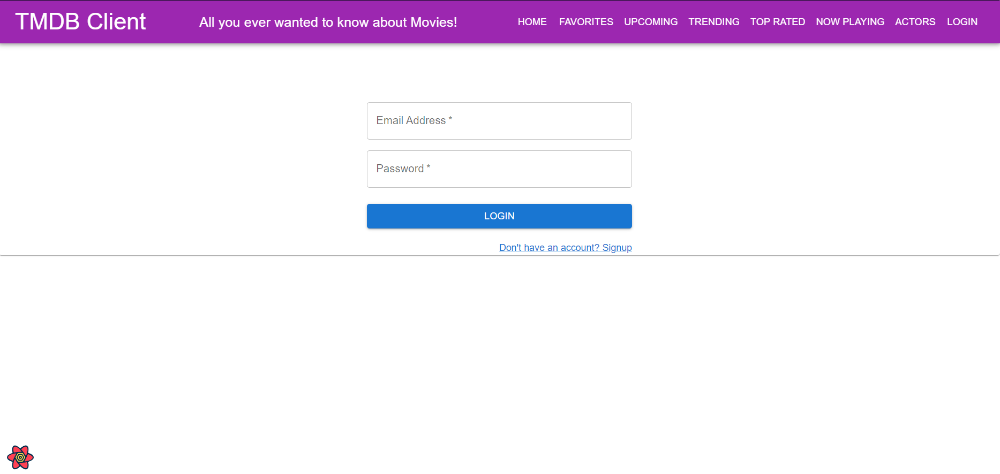
>Login Page taking in email and password. Not fully working

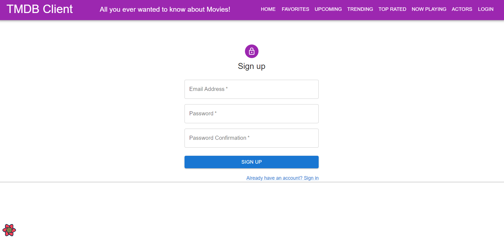
>Sign up page taking an email and password. Not fully working

>Firebase React App Image

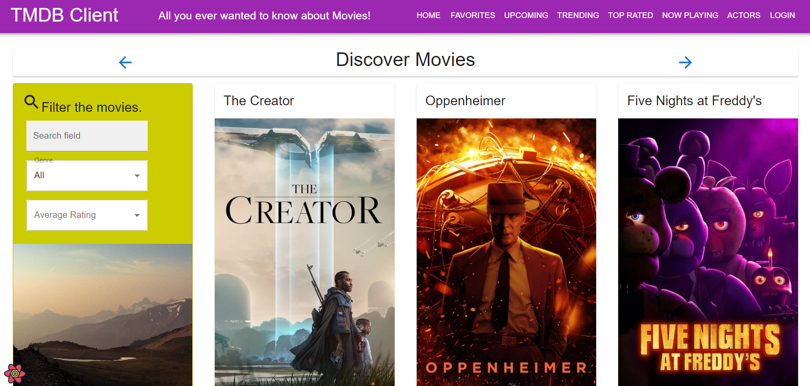
>Updated Home Page with Pagination and new filtering options

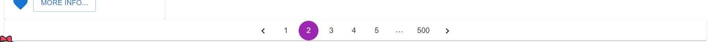
>Pagination on the homepage is showcased here

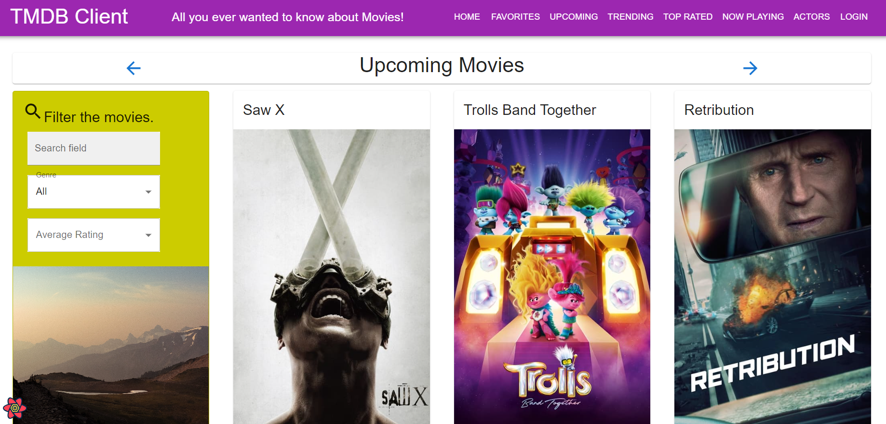
>Upcoming movies page

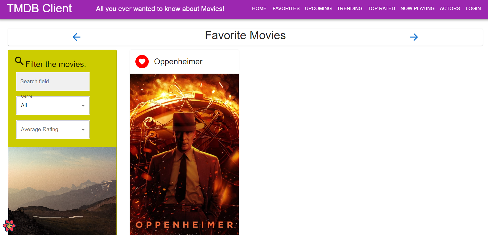
>Favourites Movie page(Private routes not implemented)

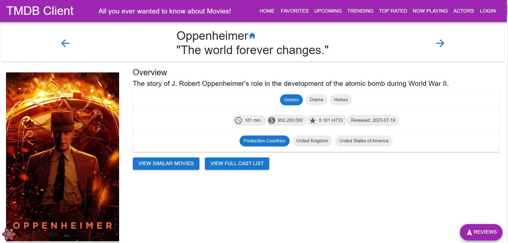
>Updated Movie details page with new buttons

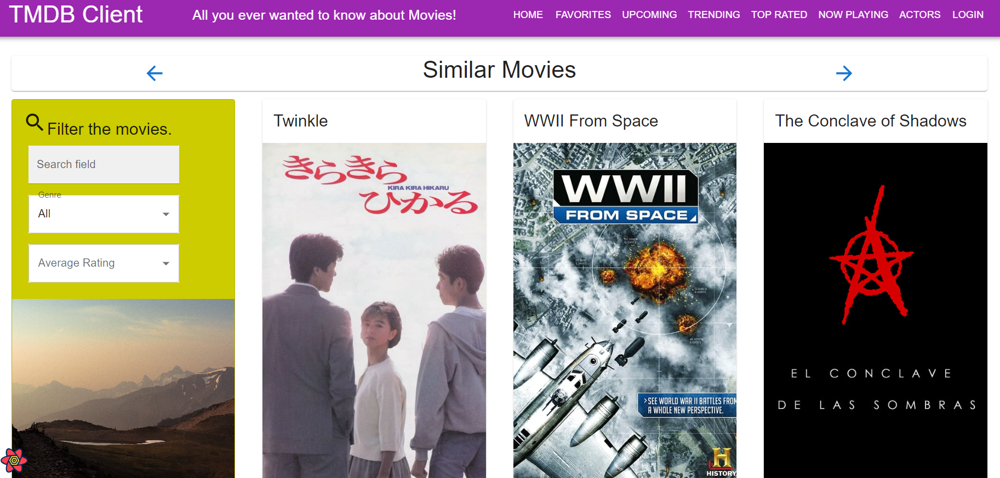
>New Similar Movies page

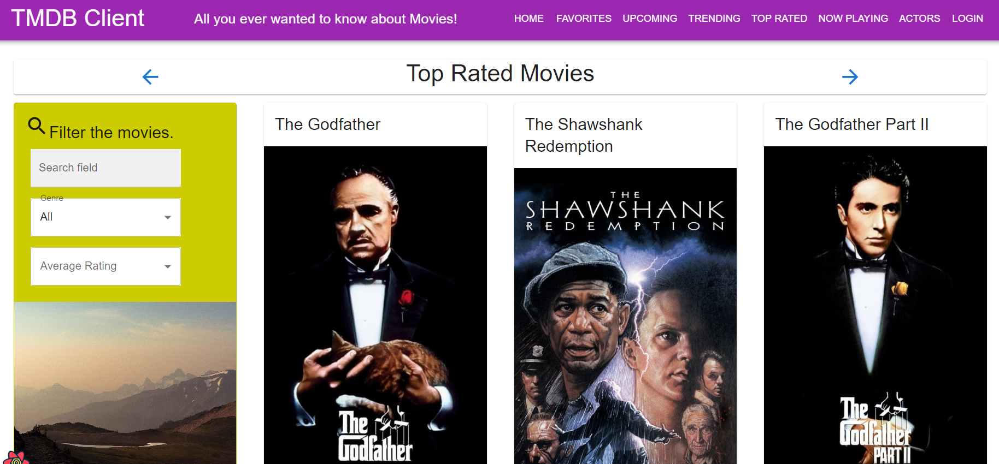
>New Top rated Movies Page

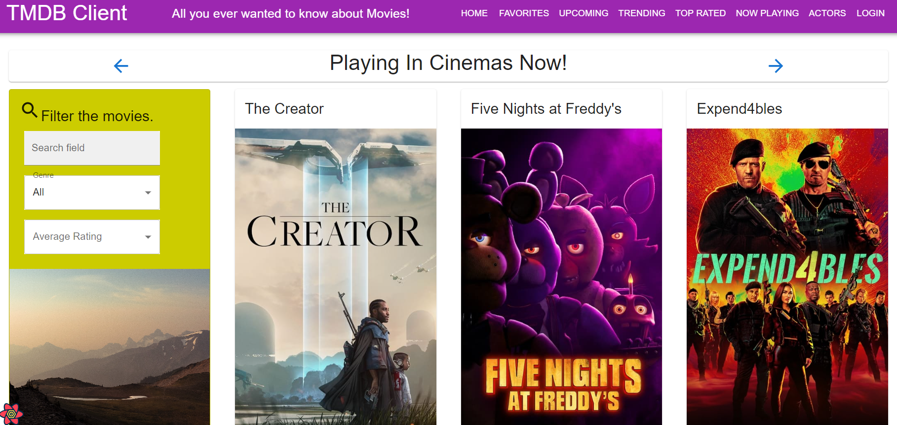
>New Now-Playing movies page

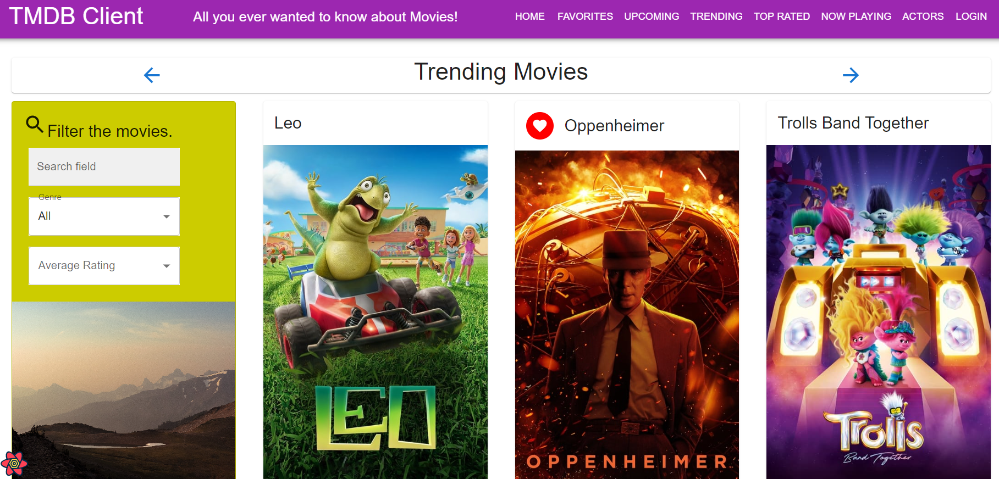
>New Trending Movies Page

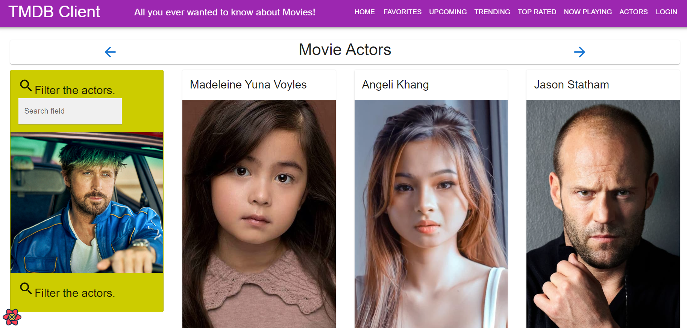
>List of popular movie actors

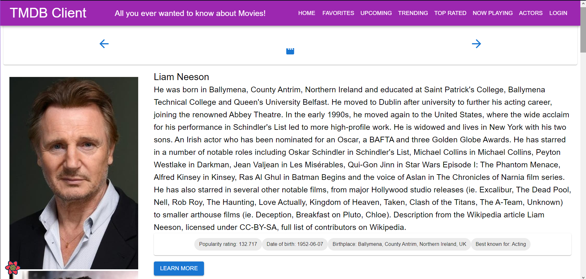
>Specific actor details page

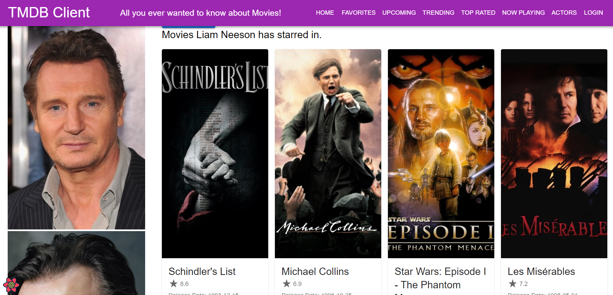
>Specific actors filmogrophy displayed

## Independent learning (If relevant).

Firebase - https://firebase.google.com/docs?gclid=CjwKCAiAksyNBhAPEiwAlDBeLFmJbo_e3-ogmR35UAUMkE9IIanL7VSwEQbkimCxlwelRP1Ae2hmqBoC1H8QAvD_BwE&gclsrc=aw.ds

https://firebase.google.com/docs/web/setup

Pagination - https://mui.com/material-ui/react-pagination/

https://hygraph.com/blog/react-pagination

